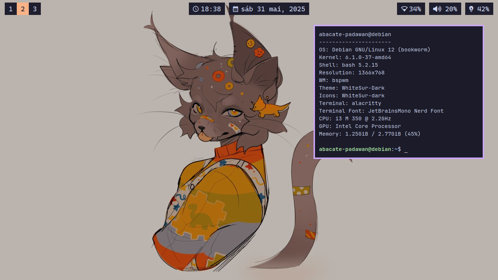

# Dotfiles

Uso o chezmoi para gerenciar meus dotfiles.

| Software                         | Detalhes                         |
|----------------------------------|----------------------------------|
| **OS**                           | Debian GNU/Linux                 |
| **WM**                           | bspwm                            |
| **Terminal**                     | alacritty                        |
| **Multiplexador**                | tmux                             |
| **Shell (alacritty)**        | fish                             |
| **Editor**                       | lazyvim (nvim)                   |
| **Gerenciador de notificações**  | dunst                            |
| **Menu de aplicações**           | rofi                             |

